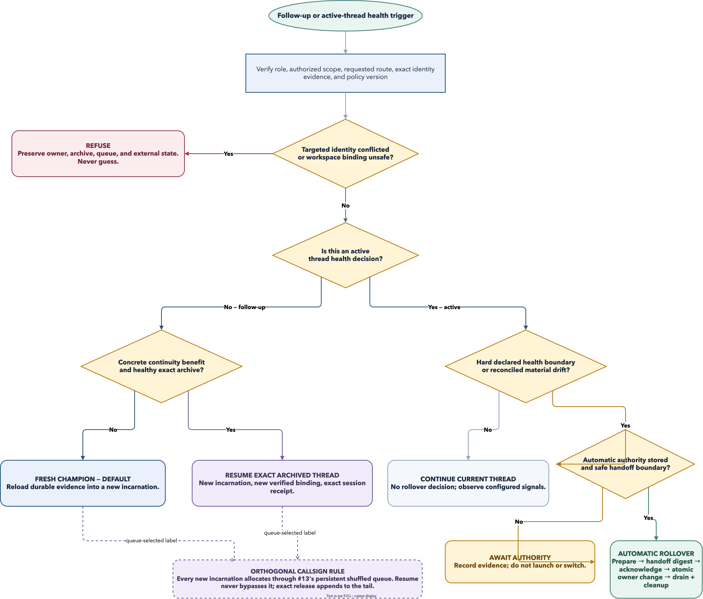

# Continuation and rollover policy

> **Status: accepted-policy candidate for issue #15; design only.** This policy
> defines future behavior but does not implement thread resume, callsign queueing,
> Champion or Shotcaller replacement, hooks, installation, cutover, or teardown.
> Issue #8 owns guarded handoff and issue #13 owns the persistent shuffled
> callsign queue. Issue #23 retains isolated acceptance and live-cutover gates.

Policy identifier: `league.continuation-policy.v1`. This Markdown document is
the sole normative definition. The HTML and diagram are accessible,
non-normative review views; if either differs, this document governs.

## Accepted resolutions

1. **Fresh is the default.** Assign a fresh Champion unless exact-thread
   continuity has a named concrete benefit and the archived context is healthy.
2. **Resume is exact or refused.** Resume only one durable, unambiguous archived
   thread through an adapter that declares exact resume and safe cwd/worktree
   binding. A callsign, topic, repository, or transcript locator is not identity.
3. **Rollover is a guarded owner replacement.** A replacement receives a bounded
   handoff and acknowledges its exact digest before one atomic owner switch. The
   old incarnation remains authoritative until that commit.
4. **Thresholds do not create authority.** The default is
   `awaiting_authority`. Automatic rollover is allowed only for already
   authorized same-scope work when a stored policy explicitly enables it and a
   safe handoff boundary is proven.
5. **The core contract is role-neutral.** Champions and Shotcallers use the same
   evidence, health, decision, handoff, acknowledgement, fence, and rollback
   rules. A Champion switch rebinds one task. A Shotcaller switch changes one
   stable Squad's current Shotcaller pointer; its active Champions do not move,
   restart, or duplicate. Current task cleanup remains Shotcaller-ineligible;
   issue #8 must add a guarded Shotcaller drain/cleanup policy that reuses the
   proof-first action, receipt, and fence pattern without weakening that rule.
6. **Callsigns never carry continuity.** Every new incarnation uses issue #13's
   queue. Resume does not bypass that queue or steal a rebound name.

The editable flow source is
[`continuation-rollover-policy.drawio`](continuation-rollover-policy.drawio),
with an exported
[`SVG`](continuation-rollover-policy.drawio.svg). The accessible review surface
is [the issue-#15 Lavish artifact](../../.lavish/issue-15-continuation-rollover-policy.html).



### Current merged boundary

The merged runtime exposes a generic `RuntimeLifecycle.resume` operation, but
the built-in Codex harness contract does not declare `resume`, Herdr/tmux
drivers remain contract-only, and the acceptance receipt still labels real
runtimes unverified. No current built-in therefore qualifies for exact-thread
resume or automatic rollover. The current store also keeps
`runtime_bindings.session_identity` unique and the current task cleanup planner
refuses Shotcaller owners. The future #8 schema must preserve those safeguards:
normalize one unique provider thread identity into the archive/lineage record,
link incarnation-specific endpoint bindings to it, and add Shotcaller handoff
cleanup without making a Shotcaller eligible for task teardown.

## Four independent lifecycles

| Lifecycle | Canonical question | Required action | Must not decide |
| --- | --- | --- | --- |
| Runtime teardown | Can the exact disposable endpoint and resources be released safely? | Archive immutable identity/evidence, close the exact endpoint, remove only eligible disposable resources, then release the callsign. | Whether any archived thread should resume. |
| Callsign queue | Which compatible available label ranks first now? | Use issue #13's persisted shuffled order; reserve atomically; append an activated assignment's release to the tail. | Task/thread relatedness or context health. |
| Thread continuation | Can this one archived provider thread be resumed safely? | Verify exact durable thread identity, an exclusive continuation claim, adapter capability, and a new exact cwd/worktree binding. | Whether an active thread has become unhealthy. |
| Context rollover | Should an active incarnation be replaced for the same authorized scope? | Evaluate health, authority, safe boundary, bounded handoff, acknowledgement, and atomic owner switch. | Runtime cleanup or historical callsign ownership. |

Teardown therefore completes even when a thread remains durably resumable.
Conversely, a resumable archive never preserves a runtime endpoint, worktree,
resource lease, or callsign.

## Decision table

The decision record always names the subject role, immutable incarnation,
scope, trigger, requested route, policy version, signal snapshot, outcome, and
reason codes. `auto` means League may choose; an explicit `resume` or `fresh`
request is preserved exactly and never silently rewritten.

| Situation and verified gates | Decision | Authority boundary | Durable effect |
| --- | --- | --- | --- |
| A follow-up has a concrete continuity benefit; the exact archived thread is durable and unique; the adapter declares exact resume and safe rebinding; the new repository/worktree binding is verified; context is healthy; instructions have not materially drifted; no continuation claim conflicts. | **Resume exact archived thread** | Existing authority must cover the follow-up. Resume creates a new incarnation and runtime binding; it does not revive released resources. | Record `continuation_decided: resume`, claim the exact archive, allocate a callsign through #13, launch into the verified binding, then accept only the exact thread receipt. |
| The work is new or loosely related, no concrete continuity benefit exists, context is degraded/unknown, or reloading durable evidence is cheaper and safer. No explicit exact-resume request is being overridden. | **Fresh Champion** (default) | Ordinary dispatch authority applies. | Record `continuation_decided: fresh`, allocate through #13, and use the existing recoverable assignment lifecycle. The archive stays immutable. |
| An active Champion or Shotcaller crosses a configured hard health boundary or has reconciled material instruction drift; the same scope remains authorized; a safe boundary exists; `rollover_authority=automatic` is stored. | **Automatic rollover** | The stored opt-in is authority only for the same role and scope. It grants no merge, deploy, install, teardown, or new-task authority. | Prepare replacement and bounded handoff, require exact acknowledgement, atomically switch ownership, emit one `owner_changed`, then drain and clean the predecessor. |
| The same rollover evidence exists but automatic authority is absent, or only a soft threshold is crossed. | **Await authority** | Notify the Summoner with the evidence and proposed boundary. Do not launch or switch. | Record `continuation_decided: awaiting_authority`; current ownership and intake rules remain unchanged unless health already requires a safe intake pause. |
| An explicit resume/rollover target has missing, ambiguous, duplicated, or reused thread identity; durability/capability is undeclared; the workspace cannot be safely rebound; instruction drift is unresolved; a continuation/rollover fence conflicts; acknowledgement mismatches; or no compatible callsign is available. | **Refuse** | Manual reconciliation or new authority is required. A general follow-up that did not target the bad archive may be submitted separately for fresh dispatch. | Record a bounded refusal code and evidence digest. Preserve archives, current owner, queue order, and external state; never guess or partially switch. |

### Concrete continuity benefit

At least one recorded benefit is required for resume:

- `same_task_recovery`: resume one interrupted or blocked operation whose durable
  recovery fence and next action name the exact thread;
- `same_artifact_revision`: revise or diagnose the same exact unlanded artifact,
  branch head, review finding set, or acceptance receipt; or
- `unresolved_decision_chain`: continue a bounded, acknowledged decision chain
  whose alternatives and evidence references are already attached to the
  archive.

The same callsign, repository, broad topic, issue family, or user familiarity is
never enough. If the durable handoff already contains everything needed, the
fresh default wins.

## Provider-neutral evidence and health

League consumes normalized facts and never parses provider transcripts to
invent them. An adapter declaration names which signals it can produce, their
durability, units, and observation time. A signal missing from that declaration
is unavailable, not zero.

| Signal | Trust rule | Default policy use |
| --- | --- | --- |
| Exact thread identity and durability | One namespaced opaque thread identity must be unique in canonical state and the adapter must declare it durable. Ambiguous, duplicated, or reused identity is a conflict. | Mandatory for resume and for predecessor/replacement linkage. Conflict refuses. |
| Safe cwd/worktree binding | Verify repository identity, issue/scope, branch/head as applicable, a newly allocated non-conflicting worktree/cwd, and adapter support for binding before launch/resume. | Mandatory. Unsafe or unverifiable binding refuses the targeted operation. |
| Context remaining | Use only an adapter-declared capacity and observation that normalize to a remaining ratio. Never derive it from serialized transcript bytes. | Soft at `0.30`, hard at `0.15` in the initial config. |
| Compaction count | Record only when the adapter declares what one compaction means and whether the count survives restart. | Observed but unthresholded by default; per-adapter configuration may add soft/hard values. Never a sole hard failure by default. |
| Transcript/token budget | Use only when the adapter declares the budget, units, measurement point, and comparability. Raw bytes or token counts from unlike providers are not comparable. | Disabled by default (`null` thresholds). A provider profile may configure normalized ratios. |
| Elapsed age | Compute from canonical creation/archive timestamps, not runtime uptime. | Soft at 14 days; no hard default. Age alone never triggers automatic rollover. |
| Completed task count | Count acknowledged completed scopes carried by the same thread lineage. | Soft at 2; no hard default. Count alone never triggers automatic rollover. |
| Instruction drift | Compare stored and current digests for governing global, repository, task, and policy instructions, then classify `none`, `non_material`, `material`, or `unknown`. | `material` or `unknown` blocks archive resume until reconciled. Material drift makes an active thread a rollover candidate at a safe boundary. |

Health is derived as follows:

- **healthy**: every mandatory identity/binding/instruction gate passes and no
  available signal crosses a soft or hard threshold;
- **degraded**: mandatory gates pass but one or more soft thresholds cross;
- **unhealthy**: a declared hard context threshold crosses or reconciled
  material instruction drift makes the current context unsafe to continue; and
- **conflicted**: exact identity, lease, fence, or acknowledgement evidence is
  missing, ambiguous, duplicated, reused, or contradictory.

Resume requires `healthy`. A degraded archive routes fresh. An unhealthy active
thread requires rollover at the next safe boundary, subject to authority. A
conflicted subject refuses and preserves state.

### Initial versioned configuration

These values are data, not control-flow constants. Every decision stores the
configuration version and digest that produced it. Operators may change values
only through a reviewed configuration revision; existing decisions remain
explainable.

```json
{
  "schema": "league.continuation-policy.v1",
  "follow_up_default": "fresh",
  "rollover_authority": "awaiting_authority",
  "handoff": {
    "max_bytes": 65536,
    "active_champion_page_size": 100,
    "active_champion_page_size_max": 500,
    "snapshot_ttl_seconds": 900
  },
  "thresholds": {
    "context_remaining_ratio": {"soft": 0.30, "hard": 0.15, "source": "adapter_declared"},
    "compaction_count": {"soft": null, "hard": null, "source": "adapter_declared"},
    "transcript_budget_remaining_ratio": {"soft": null, "hard": null, "source": "adapter_declared"},
    "elapsed_age_days": {"soft": 14, "hard": null, "source": "canonical"},
    "completed_task_count": {"soft": 2, "hard": null, "source": "canonical"}
  }
}
```

`null` means record the signal but do not threshold it. An adapter-specific
profile may supply calibrated values; it may not silently replace this policy
or claim a signal it cannot observe.

## Handoff and acknowledgement

A handoff is bounded, public-safe metadata plus references to separately owned
evidence. It contains:

- stable Squad/task/request identity, old and proposed incarnation identity,
  role, scope, authority, explicit non-goals, and policy/configuration digest;
- current state, last material event, unresolved requests/tasks/claims,
  pending decisions, blockers, next actions, and delivery/cleanup obligations;
- repository, issue, branch/head, PR/CI or deployment evidence references only
  when applicable, plus clean/unpublished state and safe new binding proof;
- for Shotcaller rollover, one immutable active-Champion binding snapshot
  reference, version, total count, configured page bound, expiry, and SHA-256
  digest—never the complete binding map;
- decisions already made, alternatives rejected, bounded evidence digests, and
  current instruction digests with any reconciled drift;
- context-health inputs, threshold outcomes, concrete continuity benefit, and
  why fresh/resume/rollover was selected;
- callsign reservation state, runtime adapter capability declarations, rollback
  point, and handoff expiry.

It never copies a full transcript, secret, credential, private endpoint, local
absolute path, browser state, arbitrary generated artifact, or complete active-
Champion binding map. The replacement acknowledges the exact handoff digest,
its own exact identity and binding, the scope/non-goals, and unresolved work. A
prose “received” message is not acknowledgement.

For a Shotcaller rollover, the snapshot reference resolves only through
`league rollover bindings OPERATION_ID [--cursor CURSOR] [--limit COUNT]`.
Every page repeats the immutable snapshot ID/version, total count, page bound,
expiry, and digest and returns an opaque `next_cursor`; the configured maximum
is enforced server-side. Snapshot rows are canonically ordered by immutable
Champion incarnation ID, encoded as stable compact JSON, and hashed with
SHA-256. The acknowledgement supplies the observed snapshot version, count,
and digest after retrieving all pages. League independently verifies those
values against the frozen snapshot and the current Squad owner version/fence
before accepting the acknowledgement. Missing/repeated rows, cursor/version
changes, expiry, digest/count mismatch, or a changed owner fence invalidates the
acknowledgement and requires a fresh snapshot; no partial map may be accepted.

After the owner switch, expiry never permits an old page, cursor, row digest, or
acknowledgement to be reused. `league rollover refresh-bindings` may point the
same `switched` operation to one new immutable snapshot revision only when the
caller supplies the exact operation, Squad, predecessor, successor, rollover
version, source snapshot version/digest, and a later expiry. League re-reads the
complete canonical descendant set, observes every exact live Herdr identity in
two complete inventories, and requires the normalized observations to be
identical before CAS-updating only the operation snapshot pointer/version plus
one receipt event. Both observation digests are bound to that receipt. Runtime
generation is derived from the observed terminal plus the exact session/thread
identity and must also equal the canonical generation when one exists. A
changed endpoint, route, session, terminal, sequence, descendant set,
owner/fence, runtime ambiguity, missing or unready endpoint, or concurrent
canonical mutation refuses without inserting or pointing at a new revision.
The original revision remains immutable evidence; refresh does not repeat
acknowledgement or switch ownership.

## Crash, rollback, and callsign behavior

The rollover operation is fenced and recoverable:

1. Record the immutable decision and authority mode.
2. Reserve a callsign through #13 and prepare only the replacement's exact
   runtime/workspace resources. The predecessor remains owner.
3. Persist the handoff; launch; accept the exact replacement receipt; obtain an
   acknowledgement for the handoff digest.
4. In one transaction, compare the old owner version and rollover fence, switch
   the task or Squad owner pointer, append `owner_changed`, and enqueue its
   recipient outbox effects.
5. Mark the predecessor draining so it refuses new intake, then use the existing
   task cleanup obligation/executor for a Champion or #8's separately guarded
   Shotcaller drain/cleanup policy. Both use the proof-first action/receipt/fence
   pattern and release the predecessor's callsign last.

Before step 4, abort closes only exact replacement resources and restores an
unactivated callsign reservation to its prior queue position; the predecessor
continues unchanged. A crash after acknowledgement but before step 4 recovers
to the same choice: retry the fenced commit or abort. A crash after step 4 never
rolls ownership back: recovery rolls forward the predecessor's drain and
cleanup idempotently. At no point may both incarnations accept intake.

Issue #13 supersedes issue #15's obsolete never-used generation, quarantine,
cooldown, and least-recently-used fallback language:

- initialize one non-alphabetical shuffled queue once and persist its seed and
  version;
- allocate the first compatible available entry; skip incompatible entries
  without reordering them;
- move `available` → `reserved` atomically and `reserved` → `active` only after
  exact assignment/runtime acceptance;
- exact release appends to the tail; recent reuse is ranking, not a ban;
- allocate a recently released sole compatible candidate; and
- refuse only when no compatible available name exists, reporting bounded
  active, reserved, and incompatible counts/reasons.

Resume never receives callsign priority. If the historical callsign is selected
normally, the new assignment may use it. If it is active, reserved, disabled, or
rebound, the resumed thread receives another queue-selected callsign. Historical
events keep the old callsign and immutable incarnation/thread references; no
alias is rewritten and no name is stolen.

## Retention, compaction, and archive boundaries

This policy extends issue #21's accepted request-payload rule: immutable small
identity, lineage, decision, event, and receipt records remain canonical;
optional bulky bodies and detail rows are bounded and removable only by an
explicit versioned retention policy. It reuses the configured
`retention.resolved_days`, `retention.compact_after_mb`, and
`retention.batch_size` gates and maintenance receipts defined in
[the accepted pruning policy](sqlite-request-lifecycle.md#13-pruning-and-maintenance),
rather than introducing rollover-specific ages or size constants.

| Record class | Permanent canonical minimum | Separately bounded or removable material |
| --- | --- | --- |
| Thread archives and continuation lineage | Unique namespaced provider thread identity; durability/capability declaration digest; creation/archive time; incarnation links; instruction/policy digests; terminal resumability state; final health summary; continuation decision IDs and reason codes. These small rows are never deleted because they prevent ambiguous or reused identity. | Optional transcript/context exports and superseded detailed signal snapshots live only as private evidence payloads. Their bodies may be pruned; the hash, byte count, retention class, durability, summary, and `pruned_at` tombstone remain. Pruning makes any dependent resume unavailable, never guessed. |
| Evidence and handoff references | Evidence/reference ID, owning aggregate, content hash, byte count, media type/class, durability, bounded summary, and acknowledgement/commit/abort receipt remain. | Evidence bodies, archived artifacts, handoff bodies, and active-Champion snapshot rows may be removed only after every owning operation is terminal, the required acknowledgement plus `owner_changed` or abort receipt exists, no active claim/pin/reference remains, and the shared age/size gates pass. Snapshot header, count, digest, expiry, and outcome remain. |
| Callsign assignments | Every immutable assignment identity, callsign, incarnation, queue/lease versions, activation/release timestamps, and activation/release receipt remains. This is the minimum needed to distinguish reuse from continuity. | Adapter-private launch/release response bodies and retry detail are separate payload/detail rows and may compact only after a proved terminal receipt. |
| Callsign release history | Bounded `callsign_activated` and `callsign_released` event facts, queue versions, reason code, and receipt digest remain immutable. | Repeated delivery/adapter attempt detail may compact under the accepted terminal-attempt policy; the permanent event/outbox summary remains. |
| Rollover operations | Stable old/new incarnation IDs, role/scope, authority mode, fence and owner versions, handoff/snapshot digests, final state, acknowledgement, owner-change or abort receipt, and policy version remain. | Superseded preparation traces and acknowledged handoff/snapshot bodies follow the evidence rules above. |

Maintenance is never a hook-side or rollover-side effect. One bounded run selects
at most the configured batch, records the exact policy version and before/after
counts, and removes only material explicitly named by that policy. Active,
reserved, preparing, awaiting-authority, unacknowledged, draining, conflicted,
or otherwise unresolved records are never compacted. Missing summaries,
receipts, digests, reference closure, or export proof refuse pruning. Space
reclamation remains separately explicit; a crash resumes or rolls back the
bounded maintenance unit without leaving a missing body and absent tombstone.

## Minimal future implementation contract for #8 and #13

Implementation should extend the current stable `league.command.v1` envelope,
expected-version/fence rules, event/outbox atomicity, recoverable assignments,
opaque runtime identity, proof-first cleanup, and issue-#23 acceptance boundary.
It must not create a second request, assignment, watcher, cleanup, or delivery
state machine.

### Stable command surface

| Owning issue | Command family | Contract |
| --- | --- | --- |
| #8 | `league continuation decide|status` | Record/read one evidence snapshot and `resume`, `fresh`, `rollover`, `awaiting_authority`, or `refuse` outcome. `decide` is side-effect free outside canonical state. |
| #8 | `league rollover prepare|acknowledge|commit|abort|status` | One fenced two-phase replacement for either role. `commit` requires exact acknowledgement and performs the single owner change; `abort` is pre-commit only. |
| #8 | `league rollover bindings OPERATION_ID [--cursor CURSOR] [--limit COUNT]` | Read one frozen Shotcaller active-Champion snapshot in bounded stable pages. Each page repeats snapshot version/count/digest/expiry and returns an opaque next cursor; acknowledgement verifies the fully retrieved digest against the owner fence. |
| #23 | `league rollover refresh-bindings --operation-id OP --refresh-id ID --squad-id SQUAD --predecessor-agent-id OLD --successor-agent-id NEW --expected-rollover-version N --expected-snapshot-version N --expected-snapshot-digest DIGEST --expires-at TIME --at TIME` | Replace only an expired snapshot for the exact already-switched operation after one full canonical read and two identical Herdr observations. The operation version and snapshot pointer move by CAS; the prior revision and owner switch remain immutable. |
| #13 | `league callsign allocate|status` | Select and reserve the first compatible queue entry atomically; return queue version and bounded refusal counts. |
| #13 | existing `league callsign release` | Append an activated released assignment to the tail under an exact lease/version precondition. Failed unactivated reservations restore their recorded queue position. |

### Minimal durable data

- `thread_archives`: the one unique opaque provider thread identity,
  provider-declared durability/capabilities, instruction digests, last health
  snapshot, and evidence/handoff references. Incarnation-specific runtime
  bindings reference this row and retain their own unique endpoint/generation;
  they do not duplicate the provider thread identity;
- `continuation_decisions`: trigger, requested route, concrete benefit, signal
  snapshot, policy/configuration digest, outcome, reason codes, and authority;
- `rollover_operations`: role-neutral old/new incarnation references, stable
  scope/Squad reference, state, fence, owner versions, handoff digest,
  acknowledgement, active-Champion snapshot reference when applicable, and
  rollback/commit receipts;
- `active_champion_binding_snapshots`: one immutable header per applicable
  Shotcaller rollover with snapshot version/count/digest/expiry plus normalized
  binding rows in canonical incarnation order. Rows are retrieved in bounded
  pages and never copied into handoffs;
- issue-#21's accepted `callsign_queue` and immutable
  `callsign_assignments`, migrated deterministically from current pool position,
  lease, and release history; and
- existing task/Squad owner, runtime binding, event, outbox, cleanup obligation,
  and receipt records remain canonical for their current responsibilities.

### Stable events and refusal codes

State changes emit bounded public-safe events in the same transaction as their
canonical effect: `continuation_decided`, `thread_resumed`,
`rollover_prepared`, `rollover_acknowledged`, exactly one `owner_changed`,
`rollover_aborted`, `rollover_snapshot_refreshed`, `callsign_reserved`, `callsign_activated`, and
`callsign_released`. Payloads contain stable IDs, versions, digests, outcomes,
and reason codes—not transcript text or adapter-private locators.
`rollover_prepared` carries only the active-Champion snapshot reference and
digest; `rollover_acknowledged` carries the independently verified snapshot
version, count, and digest, not the rows.
`owner_changed` uses a `task` aggregate for Champion rollover and a `squad`
aggregate for Shotcaller rollover; #8 must extend the current event subject
constraint rather than encode a Squad change as an unrelated agent/task event.

At minimum, clients may rely on these refusal codes:
`thread_identity_missing`, `thread_identity_ambiguous`,
`thread_identity_reused`, `thread_not_durable`, `resume_unsupported`,
`workspace_binding_unsafe`, `continuation_conflict`,
`instruction_drift_unreconciled`, `rollover_authority_required`,
`handoff_ack_mismatch`, `active_champion_snapshot_stale`,
`active_champion_snapshot_incomplete`, `snapshot_refresh_not_expired`,
`snapshot_refresh_set_changed`, `snapshot_refresh_live_missing`,
`snapshot_refresh_live_ambiguous`, `snapshot_refresh_concurrent_mutation`, and
`callsign_unavailable`.

## Focused future acceptance

Issues #8 and #13 should use only temporary roots and deterministic adapters to
cover:

- every row in the decision table for Champion and Shotcaller subjects;
- explicit-route preservation, fresh default, unavailable optional metrics,
  threshold configuration/digesting, instruction drift, and identity conflict;
- exact resume into a new binding without restoring old runtime resources;
- handoff acknowledgement mismatch and crashes before/after every external
  action and the atomic owner switch, proving one owner and no duplicate intake;
- Shotcaller rollover with enough active Champion bindings to require multiple
  pages, no embedded complete map, stable cursor/version semantics, digest/count
  verification, and refusal for a missing/repeated/mutated/expired page set;
- retention eligibility and crash recovery proving immutable identity, receipt,
  reference, assignment, and release summaries survive while only configured
  terminal bulky payload/detail rows are pruned in bounded batches;
- persisted shuffled order across restart, concurrent non-duplication,
  incompatible skip without reorder, reservation rollback, release-to-tail,
  full sequential rotation, and sole-compatible recent reuse; and
- public-safety rejection for private paths, runtime-private locators,
  transcripts, credentials, and unbounded payloads.

Repository-local deterministic proof does not establish a real adapter, live
hook, installed runtime, migration, cutover, or smoke result. Those claims stay
pending until issue #23 records the separately authorized acceptance receipt.

## Questions resolved: non-normative index

This table is navigation only. It neither restates nor modifies policy; the
linked normative sections are authoritative.

| Issue #15 question | Normative source |
| --- | --- |
| When is a follow-up related enough? | [Concrete continuity benefit](#concrete-continuity-benefit) |
| Is fresh still the default for related work? | [Accepted resolutions](#accepted-resolutions) and [Decision table](#decision-table) |
| Which size/staleness signals are reliable? | [Provider-neutral evidence and health](#provider-neutral-evidence-and-health) |
| Does crossing a threshold automatically replace the agent? | [Decision table](#decision-table) and [Initial versioned configuration](#initial-versioned-configuration) |
| What if the historical callsign was reused? | [Crash, rollback, and callsign behavior](#crash-rollback-and-callsign-behavior) |
| How are durable history and bulky payloads retained? | [Retention, compaction, and archive boundaries](#retention-compaction-and-archive-boundaries) |
| Do Champions and Shotcallers differ? | [Accepted resolutions](#accepted-resolutions) and [Handoff and acknowledgement](#handoff-and-acknowledgement) |

There are no unresolved design questions in this candidate.
