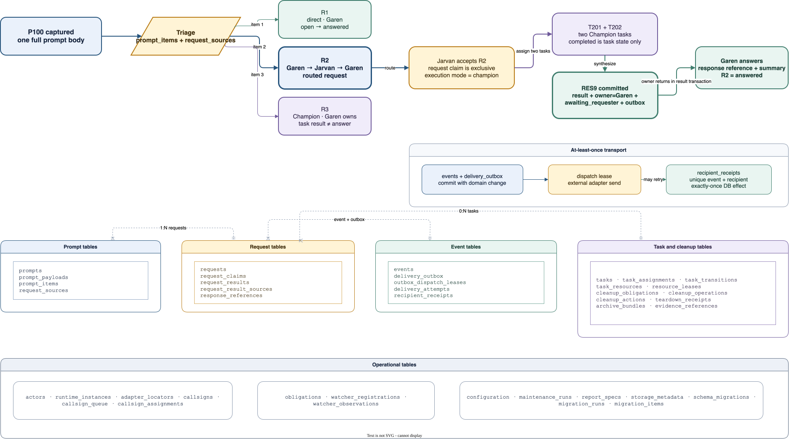

# Proposed SQLite request lifecycle

> **Status: proposed v1 design for review under issue #21.** This document is
> not an implementation claim. Issue #19 owns implementation, issue #23 owns
> isolated acceptance and cutover, and a separate explicit decision is required
> before any live install or migration.

## Accepted resolutions

These resolutions are authoritative for this design and supersede older issue
wording where it conflicts. An **invariant** is a rule that must stay true.
These are the canonical invariant definitions; later sections reference them
and add step-specific evidence rather than silently redefining them:

A **Shotcaller** is a visible coordinator that routes, synthesizes, and answers.
A **Champion** is an issue-bound worker. A **runtime** is one live command-line
window or agent process. An **adapter** is the small boundary that talks to an
external harness or terminal backend. Garen and Jarvan are synthetic Shotcaller
names in the examples below.

1. An **execution mode** means who performs work. <code>direct</code>,
   <code>hidden</code>, and <code>champion</code> are execution modes, not
   request states.
2. **Prompt-once invariant.** A **prompt** is one complete user submission.
   Store its full text exactly once in <code>prompt_payloads</code>. Describe its
   meaningful parts in <code>prompt_items</code>, then link independently
   finishable requests to those parts through <code>request_sources</code>.
3. A **request state** means where one independently finishable item stands.
   The complete v1 set is <code>open</code>, <code>routed</code>,
   <code>accepted</code>, <code>in_progress</code>,
   <code>awaiting_user</code>, <code>blocked</code>,
   <code>awaiting_requester</code>, <code>deferred</code>,
   <code>answered</code>, and <code>cancelled</code>.
4. **Task/request invariant.** <code>completed</code> is a Champion task state.
   It never automatically answers a request. A Shotcaller must synthesize the
   task result and explicitly answer or otherwise dispose of the request.
5. **R2 return invariant.** For routed request <code>R2</code>, ownership
   returns from Jarvan to Garen in the same all-or-nothing SQLite
   **transaction** that records Jarvan's result.
6. **Delivery-completion invariant.** Delivery uses **at-least-once
   transport**, meaning an adapter may send the same envelope again after
   uncertainty. One successful acknowledgement transaction inserts the unique
   <code>recipient_receipts</code> row, applies the recipient-side database
   effect, sets <code>delivery_outbox.state=delivered</code>, and deletes that
   outbox row's <code>outbox_dispatch_leases</code> row. This makes the database
   effect exactly once and prevents a completed delivery from remaining
   claimed.
7. **Lease-separation invariant.** A **lease** is expiring permission held by
   one runtime. A request claim is permission to mutate one request; an outbox
   dispatch lease is permission to send one queued delivery; and a watcher
   registration lease says which live endpoint may receive a wake. They never
   substitute for one another.

## Read this first

League is a local coordination layer. A **watcher** is a bounded listener that
wakes a Shotcaller for durable events; it is not a permanent service. A
Champion may prepare delivery evidence but may not merge or deploy.

The design follows one literal user prompt, <code>P100</code>:

- <code>R1</code>: Garen answers directly.
- <code>R2</code>: Garen routes to Jarvan. Jarvan accepts it, creates two
  Champion tasks, synthesizes their results, records one owner result, and
  transfers ownership back to Garen. Garen then answers the user.
- <code>R3</code>: Garen remains owner and coordinates one local Champion.

The diagram below gives the whole story before the schema detail.

## 1. Problem, goals, and boundaries

### Problem

The filesystem baseline is safe for isolated owner-written records, but League
needs atomic ownership transfer, prompt decomposition, per-request claims,
cross-window concurrency, exact event delivery effects, indexed reconciliation,
and recoverable cleanup across several local processes. Copying more JSON files
would make those relationships and transaction boundaries harder to prove.

### Goals

- Preserve every user submission before substantive work.
- Split one prompt into zero or more independently finishable requests without
  copying the full prompt into each request.
- Let several windows work concurrently while preventing two windows from
  mutating the same request.
- Keep request state, task state, delivery state, and cleanup state independent.
- Make every database mutation idempotent, which means a retry has the same
  database effect as one successful attempt.
- Keep external process, filesystem, Git, browser, and network work outside
  SQLite transactions while recording recoverable plans and receipts.
- Keep the core adapter-neutral: adapter-owned locators are opaque to League.
- Support bounded indexed reconciliation, reporting, maintenance, migration,
  rollback, and public-safe evidence retrieval.

### Non-goals

- No daemon, server, ORM, model-driven scheduler, hierarchy, or database UI.
- No automatic inference that a Champion succeeded, a request was answered, or
  cleanup is safe.
- No transaction remains open during a model call, process launch, Git action,
  browser operation, network delivery, file copy, or process wait.
- No second canonical JSON/JSONL writer after cutover.
- No live migration, install, hook edit, watcher replacement, merge, deployment,
  or teardown in issue #21.
- No full harness transcript, attachment body, large report, screenshot, or
  arbitrary binary stored as a SQLite payload.

### Storage decision and runtime gate

[ADR 0002](../adr/0002-sqlite-canonical-store.md) accepts SQLite as the
canonical v1 coordination store after a separately authorized cutover because
it provides transactions, foreign keys, uniqueness, indexes, and crash recovery
without a server. ADR 0001 remains the live runtime decision until that
cutover. The application-linked SQLite library—not a separate shell
executable—determines safety. Write startup selects:

- WAL, or write-ahead logging, only when the loaded library is version 3.51.3
  or newer. WAL lets readers continue while one short write commits.
- Rollback-journal mode when the loaded library is older. This is a compatibility
  path with lower read/write concurrency, not permission to ignore the version
  report.

Every connection enables foreign keys, uses short transactions, and applies a
bounded busy wait. Proposed v1 defaults are a 1,000 ms busy timeout and at most
three whole-transaction retries with bounded jitter. Exhaustion returns a
visible <code>storage_busy</code> result; it never waits forever.

Primary SQLite references:
[about](https://www.sqlite.org/about.html),
[atomic commit](https://sqlite.org/atomiccommit.html),
[isolation](https://www.sqlite.org/isolation.html),
[WAL and the WAL-reset fix](https://www.sqlite.org/wal.html#the_wal_reset_bug),
and [appropriate uses](https://sqlite.org/whentouse.html).

## 2. One lifecycle, from prompt to cleanup

1. The prompt adapter captures <code>P100</code> and its full payload once.
2. Garen triages it into three ordered prompt items and requests
   <code>R1</code>, <code>R2</code>, and <code>R3</code>.
3. A runtime claims a request before substantive mutation.
4. The owner records an execution mode separately from the request state.
5. Cross-Shotcaller routing changes the owner and creates one durable event plus
   one outbox row in the same transaction.
6. Adapters transport the committed event. A unique recipient receipt applies
   the database effect once even after duplicate delivery.
7. Champions report task transitions. Their completed task results return to
   their coordinating Shotcaller, not directly to the user request.
8. The request owner synthesizes task results into one request result.
9. For cross-Shotcaller work, result creation, ownership return, request-state
   change, and return outbox insertion commit together.
10. The requester answers the user and records a bounded response reference.
11. Reconciliation surfaces overdue requests, missed task transitions,
    undelivered events, and cleanup obligations without guessing outcomes.
12. Separately authorized landing and release evidence can make a cleanup
    obligation eligible.
13. One deterministic cleanup operation records a versioned plan, performs each
    external action outside a database transaction, and stores an immutable
    receipt for every result.

## 3. Stable proposed v1 schema

Table names below are exact within this design. Implementation may add indexes,
checks, and non-semantic bookkeeping columns, but renaming or splitting these
tables requires an explicit design change in issue #19.

All durable IDs are opaque typed strings allocated by League and protected by a
unique constraint. Timestamps are UTC RFC 3339 values. Mutable current-state
rows carry a monotonically increasing <code>version</code> for compare-and-swap,
meaning a writer changes the row only if it still has the revision it read.

### 3.1 Identity and runtime

| Table | Important columns | Contract |
| --- | --- | --- |
| <code>actors</code> | <code>actor_id</code>, <code>role</code>, <code>callsign</code>, <code>active</code> | Stable logical identity; one actor may have several runtime instances. |
| <code>runtime_instances</code> | <code>runtime_instance_id</code>, <code>actor_id</code>, <code>harness_kind</code>, <code>backend_kind</code>, <code>session_ref</code>, <code>status</code>, <code>last_seen_at</code> | One live window/process. Session identity is opaque outside its adapter. |
| <code>adapter_locators</code> | <code>locator_id</code>, <code>runtime_instance_id</code>, <code>adapter_kind</code>, <code>locator_kind</code>, <code>opaque_locator</code>, <code>verified_at</code> | Namespaced routing, response, or recovery location. Core code never parses the opaque value. |
| <code>callsigns</code> | <code>callsign_id</code>, <code>name</code>, <code>role</code>, <code>capabilities</code> | Immutable callsign catalogue entry. |
| <code>callsign_queue</code> | <code>callsign_id</code>, <code>queue_position</code>, <code>availability</code>, <code>released_at</code>, <code>version</code> | Persistent shuffled availability queue; release appends to the tail. |
| <code>callsign_assignments</code> | <code>callsign_assignment_id</code>, <code>callsign_id</code>, <code>task_id</code>, <code>state</code>, <code>reserved_at</code>, <code>activated_at</code>, <code>released_at</code> | Historical assignment is immutable after release; reuse creates a new row. |

### 3.2 Prompts

| Table | Important columns | Contract |
| --- | --- | --- |
| <code>prompts</code> | <code>prompt_id</code>, <code>intake_actor_id</code>, <code>runtime_instance_id</code>, <code>source_event_key</code>, <code>triage_state</code>, <code>created_at</code> | One immutable envelope. Unique source identity makes a hook retry idempotent. |
| <code>prompt_payloads</code> | <code>prompt_id</code>, <code>body</code>, <code>body_hash</code>, <code>byte_count</code>, <code>pruned_at</code> | Exactly one full user prompt body. The row is one-to-one with <code>prompts</code>; the body may later be removed under the pruning policy. |
| <code>prompt_items</code> | <code>prompt_item_id</code>, <code>prompt_id</code>, <code>ordinal</code>, <code>summary</code>, <code>disposition</code> | Ordered semantic parts: new request, follow-up, context, acknowledgement, duplicate, or explicit deferral. |
| <code>request_sources</code> | <code>request_id</code>, <code>prompt_item_id</code>, <code>source_role</code> | Many-to-many linkage lets later prompts clarify an existing request without copying payloads. |

### 3.3 Requests, results, and response references

| Table | Important columns | Contract |
| --- | --- | --- |
| <code>requests</code> | <code>request_id</code>, <code>summary</code>, <code>requester_id</code>, <code>owner_id</code>, <code>return_to_id</code>, <code>execution_mode</code>, <code>state</code>, <code>latest_result_id</code>, <code>resolution_summary</code>, <code>next_attention_at</code>, <code>version</code> | Permanent small current-state row. Execution mode and state are separate checks. |
| <code>request_claims</code> | <code>request_id</code>, <code>runtime_instance_id</code>, <code>claim_proof_hash</code>, <code>leased_until</code>, <code>claim_version</code>, <code>released_at</code> | Temporary exclusive mutation authority for one request. Plaintext claim proof is never stored. |
| <code>request_results</code> | <code>result_id</code>, <code>request_id</code>, <code>produced_by</code>, <code>outcome</code>, <code>summary</code>, <code>payload_hash</code>, <code>created_at</code> | Owner-produced result, separate from task status and response delivery. |
| <code>request_result_sources</code> | <code>result_id</code>, <code>task_id</code>, <code>source_kind</code> | Shows which Champion tasks or direct evidence informed a synthesized result. |
| <code>response_references</code> | <code>response_ref_id</code>, <code>request_id</code>, <code>adapter_kind</code>, <code>session_locator</code>, <code>response_locator</code>, <code>durability</code>, <code>content_hash</code>, <code>created_at</code> | Adapter-neutral durable or honestly ephemeral locator. League never stores an absolute transcript path or interprets adapter internals. |

### 3.4 Events, outbox, and receipts

| Table | Important columns | Contract |
| --- | --- | --- |
| <code>events</code> | <code>event_id</code>, <code>event_seq</code>, <code>aggregate_kind</code>, <code>aggregate_id</code>, <code>event_type</code>, <code>actor_id</code>, <code>payload_json</code>, <code>created_at</code> | Immutable global order. The payload is bounded and public-safe; source content stays in owning tables. |
| <code>delivery_outbox</code> | <code>outbox_id</code>, <code>event_id</code>, <code>recipient_id</code>, <code>state</code>, <code>available_at</code>, <code>attempt_count</code>, <code>first_attempt_at</code>, <code>last_attempt_at</code>, <code>last_outcome</code>, <code>attempts_pruned_at</code>, <code>delivered_at</code> | One permanent recipient-specific delivery intent and bounded retry summary. Unique event plus recipient prevents duplicate rows. |
| <code>outbox_dispatch_leases</code> | <code>outbox_id</code>, <code>dispatcher_id</code>, <code>leased_until</code>, <code>fence</code> | Stops two dispatchers from sending the same row concurrently; expiry allows retry, while successful delivery deletes the lease under the delivery-completion invariant. |
| <code>delivery_attempts</code> | <code>attempt_id</code>, <code>outbox_id</code>, <code>adapter_kind</code>, <code>started_at</code>, <code>finished_at</code>, <code>outcome</code> | Append-only evidence while retained. Detailed rows become compactable only after terminal delivery proof and the bounded policy in section 13; the permanent outbox summary remains. |
| <code>recipient_receipts</code> | <code>event_id</code>, <code>recipient_id</code>, <code>received_at</code>, <code>effect_kind</code>, <code>effect_id</code> | Primary key is event plus recipient. The insert and recipient-side database effect share one transaction. |

### 3.5 Tasks, resources, and cleanup

| Table | Important columns | Contract |
| --- | --- | --- |
| <code>tasks</code> | <code>task_id</code>, <code>request_id</code>, <code>coordinator_id</code>, <code>champion_id</code>, <code>task_state</code>, <code>result_summary</code>, <code>version</code> | Bounded Champion work. <code>completed</code> remains a task fact only. |
| <code>task_assignments</code> | <code>task_assignment_id</code>, <code>task_id</code>, <code>runtime_instance_id</code>, <code>state</code>, <code>acceptance_receipt</code>, <code>version</code> | Recoverable pending → launching → active binding. No external launch occurs inside a database transaction. |
| <code>task_transitions</code> | <code>transition_id</code>, <code>task_id</code>, <code>from_state</code>, <code>to_state</code>, <code>update_text</code>, <code>next_action</code>, <code>blocker</code>, <code>created_at</code> | Immutable material task history. Its event and current task update commit together. |
| <code>task_resources</code> | <code>resource_id</code>, <code>task_id</code>, <code>resource_type</code>, <code>ownership_scope</code>, <code>intended_final_state</code>, <code>identity_json</code>, <code>cleanup_adapter</code> | Exact registered long-lived resources only; no discovery-by-name deletion. |
| <code>resource_leases</code> | <code>resource_id</code>, <code>holder_task_id</code>, <code>leased_until</code>, <code>released_at</code> | A shared-resource lease; releasing it never stops another holder's process. |
| <code>cleanup_obligations</code> | <code>cleanup_obligation_id</code>, <code>task_id</code>, <code>cleanup_state</code>, <code>required_policy</code>, <code>next_action</code>, <code>version</code> | Work outcome stays separate from cleanup state. |
| <code>cleanup_operations</code> | <code>cleanup_operation_id</code>, <code>cleanup_obligation_id</code>, <code>plan_version</code>, <code>state</code>, <code>fence</code>, <code>leased_until</code> | One recoverable execution for one cleanup revision. |
| <code>cleanup_actions</code> | <code>cleanup_action_id</code>, <code>cleanup_operation_id</code>, <code>ordinal</code>, <code>action_kind</code>, <code>resource_id</code>, <code>state</code>, <code>before_json</code>, <code>after_json</code> | Ordered external actions and their crash-recovery evidence. |
| <code>teardown_receipts</code> | <code>teardown_receipt_id</code>, <code>cleanup_operation_id</code>, <code>task_id</code>, <code>policy_version</code>, <code>receipt_hash</code>, <code>completed_at</code> | Immutable database proof that every required action has a receipt. |
| <code>archive_bundles</code> | <code>bundle_id</code>, <code>task_id</code>, <code>layout_version</code>, <code>bundle_locator</code>, <code>manifest_hash</code>, <code>published_at</code> | One verified filesystem evidence bundle; SQLite remains canonical for lifecycle state. |
| <code>evidence_references</code> | <code>evidence_id</code>, <code>task_id</code>, <code>bundle_id</code>, <code>relative_name</code>, <code>media_type</code>, <code>byte_count</code>, <code>sha256</code>, <code>durability</code> | Bounded content-addressed metadata for archived or external evidence. |

### 3.6 Obligations, watchers, configuration, reports, and migrations

| Table | Important columns | Contract |
| --- | --- | --- |
| <code>obligations</code> | <code>obligation_id</code>, <code>owner_id</code>, <code>kind</code>, <code>aggregate_id</code>, <code>dedupe_key</code>, <code>state</code>, <code>next_attention_at</code>, <code>details_json</code> | Indexed safety-net item for unresolved requests, stalled tasks, undelivered events, authority, and cleanup. |
| <code>watcher_registrations</code> | <code>watcher_id</code>, <code>actor_id</code>, <code>runtime_instance_id</code>, <code>wake_locator_id</code>, <code>leased_until</code>, <code>fence</code> | One short-lived wake receiver registration; it owns neither requests nor outbox rows. |
| <code>watcher_observations</code> | <code>observation_id</code>, <code>runtime_instance_id</code>, <code>observed_state</code>, <code>observed_at</code>, <code>stable_count</code>, <code>source_adapter</code> | Debounced adapter observations used to create a stalled obligation without guessing task outcome. |
| <code>configuration</code> | <code>config_key</code>, <code>value_json</code>, <code>policy_version</code>, <code>updated_at</code>, <code>updated_by</code> | Versioned user policy changed only through <code>league config</code>. Provider hook files remain files. |
| <code>maintenance_runs</code> | <code>maintenance_run_id</code>, <code>kind</code>, <code>started_at</code>, <code>finished_at</code>, <code>outcome</code>, <code>counts_json</code> | Visible bounded pruning, integrity, and explicit reclamation receipts. |
| <code>report_specs</code> | <code>report_id</code>, <code>from_at</code>, <code>to_at</code>, <code>timezone</code>, <code>scope_json</code>, <code>event_watermark</code>, <code>content_hash</code> | Reproducible report specification; source facts remain in canonical tables. |
| <code>storage_metadata</code> | <code>metadata_key</code>, <code>value_json</code>, <code>updated_at</code> | Schema revision, writer epoch, last maintenance time, and archive layout version. |
| <code>schema_migrations</code> | <code>migration_id</code>, <code>checksum</code>, <code>applied_at</code>, <code>application_version</code> | Ordered schema history; checksum mismatch refuses startup. |
| <code>migration_runs</code> | <code>migration_run_id</code>, <code>mode</code>, <code>source_snapshot_hash</code>, <code>state</code>, <code>started_at</code>, <code>finished_at</code>, <code>receipt_hash</code> | Dry-run, import, cutover, rollback, and parity receipt. |
| <code>migration_items</code> | <code>migration_run_id</code>, <code>source_kind</code>, <code>source_key_hash</code>, <code>target_kind</code>, <code>target_id</code>, <code>outcome</code>, <code>reason</code> | Per-item collision, malformed-input, import, and parity evidence without private source locations. |

### Relationship invariants

- One <code>prompts</code> row has at most one <code>prompt_payloads</code> row
  and one or more ordered <code>prompt_items</code> after complete triage.
- One request may cite several prompt items; one prompt item may explain only
  one independently finishable request unless its disposition is context or a
  follow-up.
- <code>requests.owner_id</code> is durable responsibility.
  <code>request_claims.runtime_instance_id</code> is temporary mutation
  authority. They are not interchangeable.
- One task belongs to one request; one request may have zero or more tasks.
- A task transition and its corresponding event commit in one transaction.
- One event may create several outbox rows, but each event/recipient pair is
  unique in both <code>delivery_outbox</code> and
  <code>recipient_receipts</code>.
- Every automatically removable resource belongs to one task and names a finite
  cleanup adapter. Unknown or ambiguous resources block cleanup.
- Terminal or landing task states may create cleanup obligations, but cleanup
  completion never rewrites the truthful task outcome.

## 4. State models

### Request state

<code>open</code> means triaged but not routed or accepted.
<code>routed</code> means another Shotcaller owns the requested outcome but has
not accepted it. <code>accepted</code> means the owner acknowledged
responsibility. <code>in_progress</code> means substantive direct or Champion
work is active. <code>awaiting_user</code> needs user information.
<code>awaiting_requester</code> has an owner result waiting for the originating
Shotcaller. <code>blocked</code> has a concrete impediment.
<code>deferred</code> is intentionally postponed with a next-attention time.
<code>answered</code> has a durable resolution summary and response reference.
<code>cancelled</code> records an explicit stop without pretending completion.

    open -> routed -> accepted -> in_progress
      |        |          |            |
      |        |          +----------> blocked
      |        |                       |
      |        +----------------------> awaiting_requester -> answered
      +-------------------------------> awaiting_user
      +-------------------------------> deferred
      +-------------------------------> answered
      +-------------------------------> cancelled

Only validated commands may take a transition. A state change checks the
current owner, matching claim, expected version, and required result or response
evidence.

### Execution mode

<code>requests.execution_mode</code> is nullable while unclassified, then one
of <code>direct</code>, <code>hidden</code>, or <code>champion</code>. A route
to another Shotcaller does not itself pick how that owner executes. Jarvan
accepts <code>R2</code>, then chooses <code>champion</code> and creates two
tasks. Garen keeps <code>R3</code> and also chooses <code>champion</code>.

### Task state versus cleanup state

Task state:
<code>pending</code> → <code>accepted</code> →
<code>in_progress</code> → <code>blocked</code>,
<code>ready_to_land</code>, <code>completed</code>, <code>rejected</code>,
<code>failed</code>, or <code>cancelled</code>.

Cleanup state:
<code>not_due</code> → <code>pending</code> →
<code>awaiting_authority</code> or <code>verifying</code> →
<code>planned</code> → <code>executing</code> →
<code>blocked</code> or <code>completed</code>.

A truthful <code>ready_to_land -> completed</code> task can proceed through
cleanup only when exact PR, CI, merge, release, and smoke evidence required by
its policy exists. A rejected/no-change task follows its smaller evidence
policy. Neither path requires relabeling the work as cancelled.

## 5. Literal P100 rows

The values below are synthetic design examples. They contain no live runtime,
transcript, endpoint, filesystem, or credential information.

### Prompt and triage rows

| Table | Example rows |
| --- | --- |
| <code>prompts</code> | <code>P100, intake=Garen, source_event_key=SRC-P100, triage_state=complete</code> |
| <code>prompt_payloads</code> | <code>P100, body="Question A; investigate B; implement C", body_hash=HASH-P100, byte_count=40</code> |
| <code>prompt_items</code> | <code>PI100-1, P100, 1, new_request</code>; <code>PI100-2, P100, 2, new_request</code>; <code>PI100-3, P100, 3, new_request</code> |
| <code>request_sources</code> | <code>R1 -> PI100-1</code>; <code>R2 -> PI100-2</code>; <code>R3 -> PI100-3</code> |

### Request rows after triage

| request | requester | owner | execution mode | state | summary | version |
| --- | --- | --- | --- | --- | --- | --- |
| <code>R1</code> | Garen | Garen | direct | open | Answer a bounded question | 1 |
| <code>R2</code> | Garen | Garen | unclassified | open | Investigate a cross-project concern | 1 |
| <code>R3</code> | Garen | Garen | champion | open | Coordinate a local implementation | 1 |

## 6. R2 transaction ledger

Every numbered step uses the same fields:

- **Reads** are rows checked before mutation.
- **Writes** are rows inserted or updated.
- **Transaction** is the all-or-nothing SQLite boundary.
- **External work** happens after commit with no database lock held.
- **Outbox** names the durable delivery state after the step.
- **Visible effect** is what an agent or user can truthfully observe.
- **Retry/failure** explains idempotency and the preserved failure state.

### Step 1 — capture P100

| Field | Exact design |
| --- | --- |
| Actor and command | Prompt adapter invokes <code>league request intake</code>. |
| Reads | <code>runtime_instances</code>, then <code>prompts</code> by unique <code>source_event_key</code>. |
| Writes | Insert <code>prompts(P100)</code> and <code>prompt_payloads(P100)</code>. |
| Transaction | Both inserts commit together. The unique source key makes hook replay return existing <code>P100</code>. |
| External work | None. Semantic splitting is deliberately excluded from the hook. |
| Outbox | No row. |
| Visible effect | Garen can list one untriaged prompt. The user sees no extra message. |
| Retry/failure | Duplicate hook: no duplicate payload. Storage busy: prompt remains uncaptured and the adapter refuses substantive work with a visible intake failure. |

### Step 2 — split P100 into R1, R2, and R3

| Field | Exact design |
| --- | --- |
| Actor and command | Garen runs <code>league request triage P100</code>. |
| Reads | <code>prompts(P100)</code>, <code>prompt_payloads(P100)</code>, existing <code>prompt_items</code>, and expected prompt revision. |
| Writes | Insert <code>PI100-1..3</code>, <code>R1..R3</code>, and three <code>request_sources</code>; update <code>prompts.triage_state=complete</code>. |
| Transaction | All items, requests, links, and final triage state commit together. Partial triage is refused. |
| External work | Garen's reasoning happens before the command; only the chosen bounded summaries enter SQLite. |
| Outbox | No row. |
| Visible effect | Garen sees three ordered actionable requests. |
| Retry/failure | Same deterministic triage input returns the existing rows. Conflicting item boundaries return <code>triage_conflict</code> and leave P100 unmodified. |

### Step 3 — Garen claims R2

| Field | Exact design |
| --- | --- |
| Actor and command | Garen runs <code>league request claim R2</code>. |
| Reads | <code>requests(R2)</code>, current <code>request_claims(R2)</code>, and Garen's <code>runtime_instances</code> row. |
| Writes | Insert <code>request_claims(R2, Garen-runtime, leased_until, claim_version=1)</code>; insert one <code>events(request_claimed)</code> audit event. |
| Transaction | Claim acquisition and audit event commit together only if no unexpired claim exists. |
| External work | None. |
| Outbox | No row; claim audit is non-material to other Shotcallers. |
| Visible effect | Garen's window may mutate R2. Another Garen window sees the current holder and does no R2 work. |
| Retry/failure | Same runtime renews idempotently. A stale runtime cannot write after lease recovery because the claim version and proof no longer match. |

### Step 4 — Garen routes R2 to Jarvan

| Field | Exact design |
| --- | --- |
| Actor and command | Garen runs <code>league handoff Jarvan --request R2 --expected-version 1</code>. The CLI reads claim proof from the current runtime context; it never prints or persists plaintext proof. |
| Reads | <code>requests(R2)</code>, <code>request_claims(R2)</code>, <code>actors(Garen, Jarvan)</code>, eligible <code>runtime_instances(Jarvan)</code>, and <code>watcher_registrations(Jarvan)</code>. |
| Writes | Update R2: <code>owner_id=Jarvan</code>, <code>return_to_id=Garen</code>, <code>state=routed</code>, <code>version=2</code>; release Garen's claim; insert <code>E201=request_routed</code>; insert <code>O201(E201, Jarvan, pending)</code>; create an acknowledgement <code>obligations</code> row. |
| Transaction | Ownership, state, released claim, event, outbox, and obligation commit together. |
| External work | None before commit. Adapter dispatch starts only after commit. |
| Outbox | <code>O201=pending, attempt_count=0</code>. |
| Visible effect | Garen sees R2 routed and remains requester/return recipient. Jarvan sees nothing until delivery receipt. |
| Retry/failure | Repeating with expected version 1 returns the committed R2 version 2 and E201. Unknown Jarvan or a stale claim leaves every row unchanged. |

### Step 5 — dispatch E201 and apply Jarvan's receipt

| Field | Exact design |
| --- | --- |
| Actor and command | League's dispatcher runs <code>league delivery claim O201</code>. After the adapter send, Jarvan's recipient adapter runs <code>league delivery ack O201 --event E201 --recipient Jarvan</code>. |
| Reads | <code>delivery_outbox(O201)</code>, <code>outbox_dispatch_leases(O201)</code>, Jarvan's <code>watcher_registrations</code>, <code>runtime_instances</code>, and <code>adapter_locators</code>. |
| Writes | Transaction A inserts or renews <code>outbox_dispatch_leases(O201)</code> with a new fence. After external send, transaction B inserts <code>delivery_attempts(DA201-1)</code>. Recipient transaction C inserts <code>recipient_receipts(E201, Jarvan)</code>, updates <code>O201.state=delivered</code>, deletes <code>outbox_dispatch_leases(O201)</code>, and marks the acknowledgement obligation satisfied. |
| Transaction | A only claims dispatch. C applies the accepted delivery-completion invariant: receipt, recipient effect, delivered state, lease deletion, and obligation commit together. No transaction spans transport. |
| External work | Send a bounded envelope through Jarvan's verified adapter. The envelope contains IDs, owner/requester, summary, and version—not the full P100 payload. |
| Outbox | Before receipt: <code>in_flight</code> or <code>awaiting_receipt</code>. After receipt: <code>delivered</code>. |
| Visible effect | Jarvan sees one routed request after the unique receipt. Garen sees delivery status, not acceptance. |
| Retry/failure | Lost acknowledgement may resend. The unique event/recipient receipt prevents a second database effect. Offline Jarvan leaves O201 pending with a future <code>available_at</code>; ambiguous routing records a blocked obligation. |

### Step 6 — Jarvan accepts R2

| Field | Exact design |
| --- | --- |
| Actor and command | Jarvan runs <code>league request claim R2</code>; for a routed request, successful claim also records acceptance. |
| Reads | <code>requests(R2 version=2, owner=Jarvan)</code>, <code>recipient_receipts(E201, Jarvan)</code>, <code>request_claims(R2)</code>, and Jarvan's runtime row. |
| Writes | Insert Jarvan's <code>request_claims</code> row; update R2 to <code>state=accepted, version=3</code>; insert <code>E202=request_accepted</code>; resolve the acknowledgement obligation. |
| Transaction | Claim, acceptance, current request state, and event commit together. |
| External work | None. |
| Outbox | O201 remains delivered. E202 is recorded but has no Garen outbox because routine acceptance is queryable and non-material. |
| Visible effect | Jarvan owns and may execute R2. Garen can query accepted status without a wake. |
| Retry/failure | Duplicate accept returns version 3. Wrong owner, absent receipt, or stale claim refuses without mutation. |

### Step 7 — Jarvan creates two Champion tasks

| Field | Exact design |
| --- | --- |
| Actor and command | Jarvan runs <code>league assign R2 --task "Collect dependency evidence"</code>, then <code>league assign R2 --task "Evaluate failure paths"</code>. |
| Reads | R2, Jarvan's claim, <code>callsign_queue</code>, <code>actors</code>, adapter capabilities, and any existing idempotent assignment for each task brief. |
| Writes | First short transaction per command inserts <code>T201</code> or <code>T202</code>, <code>task_assignments</code> in pending state, a <code>callsign_assignments</code> reservation, and an assignment event. After verified external launch, a second short transaction binds the exact runtime instance, activates the assignment/callsign, inserts a task delivery outbox row, and updates R2 to <code>execution_mode=champion, state=in_progress, version=4</code> only once. |
| Transaction | Reservation is atomic. Launch is external. Activation is a second atomic transaction. No half-launched runtime can appear active. |
| External work | Launch and verify each Champion through configured adapters; deliver the League-generated assignment envelope only after activation. |
| Outbox | One pending task-assignment outbox row per activated task, then delivered after each Champion's unique recipient receipt. |
| Visible effect | Jarvan sees two accepted Champion tasks. Garen sees R2 in progress, still owned by Jarvan. |
| Retry/failure | Retry resumes the same pending assignment. Failed launch rolls back only its reservation after exact cleanup proof and leaves R2 accepted/in progress as appropriate; no duplicate Champion appears. |

### Step 8 — the two Champions complete tasks

| Field | Exact design |
| --- | --- |
| Actor and command | The first Champion runs <code>league transition --task T201 --state completed --update "Dependency evidence collected"</code>. The second runs <code>league transition --task T202 --state completed --update "Failure paths evaluated"</code>. |
| Reads | Its <code>tasks</code>, <code>task_assignments</code>, current runtime identity, expected task version, and registered <code>task_resources</code>. |
| Writes | Update the task state and summary; insert one <code>task_transitions</code> row; insert one material <code>events</code> row; insert one <code>delivery_outbox</code> row to Jarvan; create <code>cleanup_obligations</code> if disposable resources exist. |
| Transaction | Task current state, immutable transition, event, outbox, and cleanup obligation commit together. |
| External work | Post-commit wake/transport only. Landing or cleanup does not run here. |
| Outbox | Champion event rows progress pending → awaiting receipt → delivered to Jarvan independently. |
| Visible effect | Jarvan sees two completed tasks and their result summaries. R2 remains <code>in_progress</code>. Garen's request is not answered. |
| Retry/failure | Duplicate transition key returns the original event. A stable idle runtime without a transition creates a stalled obligation after reconciliation; League never invents completion. |

### Step 9 — Jarvan synthesizes and returns R2 to Garen

| Field | Exact design |
| --- | --- |
| Actor and command | Jarvan runs <code>league request resolve R2 --summary "Combined dependency and failure findings" --return-to-requester</code>. |
| Reads | <code>requests(R2 version=4)</code>, Jarvan's claim, <code>tasks(T201,T202)</code>, their delivered task events, and existing <code>request_results</code> for the idempotency key. |
| Writes | Insert <code>RES9</code>; insert <code>request_result_sources(RES9,T201/T202)</code>; update R2 in the same transaction to <code>owner_id=Garen</code>, <code>state=awaiting_requester</code>, <code>latest_result_id=RES9</code>, <code>version=5</code>; release Jarvan's claim; insert <code>E205=owner_result_recorded</code>; insert <code>O205(E205,Garen,pending)</code>; create Garen attention obligation. |
| Transaction | Result, task-source links, ownership return, state, released claim, event, return outbox, and obligation commit together. This is the authoritative R2 ownership invariant. |
| External work | None before commit. Garen delivery begins after commit. |
| Outbox | <code>O205=pending, attempt_count=0</code>. |
| Visible effect | Jarvan sees R2 returned. Garen sees nothing until receipt. The user still has no answer. |
| Retry/failure | Duplicate resolve returns RES9/E205/O205. Missing task result, stale version, or expired claim leaves Jarvan as owner and R2 in progress or blocked. |

### Step 10 — Garen is offline; delivery retries

| Field | Exact design |
| --- | --- |
| Actor and command | League's dispatcher runs <code>league delivery claim O205</code>, attempts the send, then records this failed attempt with <code>league delivery fail O205 --reason receiver_unavailable</code>. |
| Reads | <code>delivery_outbox(O205)</code>, dispatch lease, Garen watcher/runtime/locator rows, and prior <code>delivery_attempts</code>. |
| Writes | Each claimed attempt appends a <code>delivery_attempts</code> row and advances <code>available_at</code>; a failed wake creates or refreshes one deduplicated undelivered-event obligation. |
| Transaction | Claim and attempt recording use separate short transactions around external send. |
| External work | Bounded adapter send, which fails because no verified Garen receiver is available. |
| Outbox | Remains <code>pending</code>; <code>attempt_count</code> increases. It is never marked delivered from a send call alone. |
| Visible effect | Jarvan sees durable return pending. Garen and the user see nothing. |
| Retry/failure | Backoff is bounded and fair across recipients. Reconnect, <code>league supervise</code>, or the Stop hook discovers the indexed pending row; no busy loop or model polling occurs. |

### Step 11 — Garen receives and claims R2

| Field | Exact design |
| --- | --- |
| Actor and command | Garen's recipient adapter runs <code>league delivery ack O205 --event E205 --recipient Garen</code>; Garen then runs <code>league request claim R2</code>. |
| Reads | O205, E205, R2 owner/version, Garen runtime identity, any prior recipient receipt, and current claim. |
| Writes | Recipient transaction inserts <code>recipient_receipts(E205,Garen)</code>, marks O205 delivered, deletes <code>outbox_dispatch_leases(O205)</code>, and satisfies the delivery obligation. Claim transaction inserts Garen's claim and preserves R2 as <code>awaiting_requester</code>. |
| Transaction | The accepted delivery-completion invariant commits the receipt, recipient effect, delivered state, and lease deletion together; request claim is a separate mechanism and transaction. |
| External work | Duplicate adapter envelopes may arrive before or after the receipt. |
| Outbox | <code>O205=delivered</code>. |
| Visible effect | Garen sees RES9 and the two source tasks. Jarvan sees delivered return. The user still has no answer. |
| Retry/failure | A duplicate E205 produces no second effect. Another Garen window loses the request-claim race and must not answer R2. |

### Step 12 — Garen answers the user

| Field | Exact design |
| --- | --- |
| Actor and command | Garen prepares the answer and runs <code>league request resolve R2 --summary "User-facing synthesis delivered"</code>. The harness response adapter supplies the opaque response locator without exposing transcript internals. |
| Reads | R2 version 5, Garen's claim, RES9, response adapter capability, and existing response idempotency key. |
| Writes | Insert <code>response_references</code>; update R2 to <code>state=answered</code>, set permanent <code>resolution_summary</code>, advance version, release claim; insert <code>E206=request_answered</code>; satisfy the attention obligation. |
| Transaction | Response reference, final request state, summary, released claim, event, and obligation commit together after the adapter has durable response evidence. |
| External work | The harness delivers the composed response. If it cannot provide a durable locator, it records <code>durability=ephemeral</code>; the bounded resolution summary remains durable. |
| Outbox | No cross-Shotcaller outbox is needed; requester and answerer are Garen. |
| Visible effect | The user sees the answer. Garen sees R2 answered. Jarvan can query the final state. |
| Retry/failure | If response evidence is not captured, R2 remains <code>awaiting_requester</code> and reconciliation surfaces it; League never marks a request answered merely because a task or model turn ended. |

## 7. R1 direct and R3 local-Champion paths

| Request | Owner path | Required database effect | What cannot close it |
| --- | --- | --- | --- |
| R1 | Garen claims, sets <code>execution_mode=direct</code>, produces the bounded answer, stores a response reference, and transitions <code>open -> answered</code>. | Claim, resolution summary, response reference, event, and claim release. | Reading the prompt or drafting text without response evidence. |
| R3 | Garen claims, sets <code>execution_mode=champion</code>, creates a linked task, receives the Champion result, synthesizes it, and explicitly answers. | Task link and transitions, task result delivery receipt, owner synthesis, response reference. | Champion <code>completed</code>, <code>ready_to_land</code>, green CI, or cleanup completion by itself. |

## 8. The three leases

| Mechanism | Protects | Holder | Acquired by | Expires to allow | Never proves |
| --- | --- | --- | --- | --- | --- |
| Request claim in <code>request_claims</code> | Mutating one request | One runtime instance | <code>league request claim</code> | Audited recovery by another verified runtime | That an event was delivered or a watcher is active |
| Dispatch lease in <code>outbox_dispatch_leases</code> | Attempting one outbox send at a time | One dispatcher execution | Internal delivery loop after commit | A later retry after uncertain send | Recipient database effect |
| Watcher registration lease in <code>watcher_registrations</code> | Choosing one current wake receiver | One verified Shotcaller runtime | <code>league supervise</code> or role-aware Stop path | Re-registration after close/restart | Request ownership, outbox ownership, or task completion |

Each lease has its own fence. A **fence** is a monotonically newer value that
prevents an expired holder from writing a late result after another holder
takes over.

## 9. At-least-once delivery, exactly-once effect

Accepted resolution 6 is the single delivery-completion invariant used by every
recipient path. The steps below specialize it without changing its contents.

1. Domain mutation and <code>events</code>/<code>delivery_outbox</code> insertion
   commit together.
2. A dispatcher leases one outbox row, commits, then sends externally.
3. The recipient validates the event, recipient, aggregate version, and adapter
   identity.
4. In one transaction, it inserts the unique
   <code>recipient_receipts(event_id, recipient_id)</code> row, applies the
   recipient-side database effect, marks the outbox delivered, and deletes its
   dispatch lease.
5. A duplicate transport send finds the receipt and returns the original effect.
6. A lost wake or crashed dispatcher leaves a durable pending row for
   reconciliation.

There is no claim of exactly-once transport. A terminal prompt or local socket
message can be duplicated. Exactly-once refers only to the guarded database
effect.

Fair draining orders eligible rows by <code>available_at</code> and
<code>event_seq</code>, with a bounded per-recipient batch. A new source-bound
event can be attempted immediately while older rows remain durable; an older
recipient cannot starve every other recipient.

## 10. Multi-window concurrency and crash recovery

### Same logical Shotcaller in several windows

- Each window has a distinct <code>runtime_instance_id</code>.
- Hook replay is idempotent through the prompt source unique key.
- Separate requests can be claimed and processed concurrently.
- A same-request race is resolved by the unique active request claim and
  compare-and-swap request version.
- Closing one window expires only its claims and watcher registration.
- Owner identity remains the logical Shotcaller, not a particular window.
- A request-scoped response returns through the claiming runtime. Unscoped
  material events use one current watcher registration and durable receipts.

### Crash points

| Crash point | Recovery |
| --- | --- |
| Before a transaction commits | SQLite rolls back; retry sees no effect. |
| After domain/event/outbox commit but before wake | Indexed undelivered outbox query finds the durable event. |
| After send but before attempt receipt | Retry may send again; recipient receipt deduplicates the effect. |
| After request claim expires | Recovery validates old holder state, records a claim-recovered event, issues a newer fence, and rejects late old writes. |
| During Champion launch | <code>task_assignments</code> remains pending or launching; retry resumes the same assignment and cleans only proven partial resources. |
| After a Champion becomes idle without transition | Two stable adapter observations create one <code>champion_stalled</code> obligation; outcome remains unknown. |
| During cleanup external action | Retry inspects exact reality before acting and records the observed result against the same cleanup action. |

## 11. Reconciliation, hooks, and latency budget

### One bounded obligations query

Before reply, wait, handoff, or turn end, League queries indexed due
<code>obligations</code> plus unresolved requests for the current owner. It
returns a bounded page, total count, and oldest age. It never scans all history
or copies whole prompt payloads into agent context.

Request reconciliation checks:

- routed past acknowledgement deadline;
- accepted/in-progress with expired owner claim or unavailable owner;
- linked tasks settled while parent request is not answered;
- awaiting requester overdue;
- deferred or awaiting-user next-attention time reached.

Task reconciliation compares active task rows with one batched adapter snapshot.
Repeated stable idle/done/missing observations create a stalled obligation.
They do not produce a result or task transition.

### Hook contract

- Prompt-submission hook: one <code>league request intake</code> hot path when
  the harness exposes reliable prompt text. Otherwise the adapter declares the
  capability absent and requires explicit intake before work.
- Stop hook: exactly one role-aware <code>league hook stop</code> handler per
  harness. For Shotcallers it queries unresolved requests, assignments,
  undelivered events, stalled tasks, and cleanup. It blocks once per fresh wait
  generation and re-arms after ordinary user priority while obligations remain.
- Champion turns do not create synthetic progress. Material changes remain
  explicit <code>league transition</code> commands.
- No hook performs network work, model calls, transcript scans, repository
  scans, maintenance batches, launches, merges, deployments, or teardown.

### Evidence-derived latency budget

Issue #17 correctly refuses an invented millisecond promise before the complete
installed path exists. The v1 budget is therefore a release gate with measured
numbers, not an unsupported constant:

- intake: one process start, identity lookup, unique-key lookup, and one short
  transaction;
- unresolved/Stop check: one process start and bounded indexed query;
- not-due maintenance check: one primary-key metadata lookup;
- due maintenance: a separately announced slow path excluded from hook latency.

Issue #19/#23 acceptance measures disabled versus enabled, cold and warm,
empty/small/large databases, and one versus concurrent writers for each
supported adapter. Required evidence is p50/p95/p99/max, failure count,
duplicate/lost count, CPU, peak memory, runtime version, journal mode, schema
revision, database size, row counts, and exact command. The Summoner-approved
measured ceiling becomes versioned configuration and CI/release evidence.

## 12. Deterministic resources, teardown, and evidence

### Typed lifetime

- <code>task-exclusive</code>: revalidate exact identity, terminate gracefully,
  wait boundedly, and prove exit.
- <code>shared-lease</code>: release only the task's lease. Never stop the shared
  service while another holder exists.
- <code>retained-handoff</code>: transfer to an accepted durable owner before
  retiring the Champion.
- <code>external-unmanaged</code>: record the boundary and never touch it.

A process identity includes an operating-system process identifier plus a
process-start identity and expected executable/ancestry. A backend endpoint,
agent session, worktree, branch, temporary directory, browser-control bridge,
poller, local server, and review session use their matching adapter-owned exact
identity. Pane and provider-specific transcript internals do not enter the core
schema or examples.

If a process already exited, teardown records <code>already_exited</code>. If
the identifier was reused, it preserves the new process. Unknown or ambiguous
live resources block cleanup. League never kills by process name, port,
callsign, or broad scan.

### Exact archive layout

The configured archive root is outside disposable worktrees. Under that root,
v1 uses exactly:

    v1/tasks/{task-prefix}/{task-id}/bundles/{bundle-id}/
      manifest.json
      receipt.json
      artifacts/{escaped-relative-name}

<code>task-prefix</code> is the first two ASCII characters of the validated
task ID. IDs use the restricted League identifier alphabet. Artifact names are
UTF-8 normalized, slash-free, and percent-escaped; <code>.</code>,
<code>..</code>, empty names, symlinks, device files, duplicate normalized
names, and case-fold collisions are refused. Root and bundle directories use
owner-only permissions. An existing bundle ID is a hard collision.

The bundle is staged, every regular file is bounded and hashed, and
<code>manifest.json</code> is verified before atomic publication. SQLite stores
the bundle locator, relative names, media types, sizes, hashes, provenance, and
durability. Large artifacts may remain in an approved external evidence store
with a content hash. Callers discover all evidence through
<code>league task show ID --receipt</code> or <code>league task export ID</code>;
they never construct archive locations.

### Cleanup order and crash recovery

1. Short transaction: claim the cleanup revision, create one versioned
   operation and ordered action rows, and commit.
2. Outside SQLite: stage and verify the evidence bundle.
3. Short transaction: record the bundle action receipt.
4. Outside SQLite, one action at a time: release shared leases; transfer retained
   resources; stop exact task-exclusive processes/pollers; end eligible review
   sessions; close the exact Champion endpoint; remove the exact clean worktree
   and eligible local branch; release the callsign last.
5. After each action, a short transaction records before/after identity and
   completed or blocked state.
6. Final short transaction: insert <code>teardown_receipts</code> and set cleanup
   completed only when every required action receipt exists.

A crash after planning resumes a planned action. A crash after an external
effect but before its receipt first inspects reality and records the observed
intended result; it does not repeat a destructive action blindly. A newer
cleanup fence rejects late writes from an expired executor.

Automatic cleanup never expands merge/deploy authority. Missing authority sets
<code>awaiting_authority</code>. Champions never merge, deploy, or tear
themselves down.

## 13. Pruning and maintenance

Request identity is permanent. Large prompt content is conditionally removable.

- Default versioned policy:
  <code>retention.resolved_days=90</code>,
  <code>retention.compact_after_mb=256</code>, and
  <code>retention.batch_size=500</code>.
- The first startup or state-writing command of the day performs one indexed
  due-time check. Human output goes to stderr; machine JSON remains stable.
- A prompt payload is eligible only when every linked request is answered or
  cancelled, every answered request has a non-empty permanent resolution
  summary, the newest resolution is older than the configured age, and database
  size exceeds the configured threshold.
- One transaction removes only
  <code>prompt_payloads.body</code>, retains the prompt row, hash, size,
  relationships, requests, summaries, events, references, and receipts, then
  records <code>pruned_at</code> and policy version.
- Detailed <code>delivery_attempts</code> rows are eligible under the same
  90-day, 256 MB, and 500-row gates only when their outbox is terminal and has
  either a recipient receipt for delivery or an explicit cancellation event.
  Pending, in-flight, awaiting-receipt, or unproved terminal attempts are never
  compacted.
- Before deleting eligible attempt detail, one transaction verifies the exact
  <code>attempt_count</code>, stores the first and last attempt timestamps and
  final outcome on the permanent <code>delivery_outbox</code> row, sets
  <code>attempts_pruned_at</code>, and deletes at most the remaining batch
  allowance. Missing or inconsistent aggregates refuse compaction.
- Missing summaries refuse pruning. Unresolved, awaiting, blocked, deferred, or
  in-progress work is never pruned.
- Maintenance does not open or verify external transcript/GitHub references and
  never runs a network request.
- A run is visibly announced and processes at most the configured batch. A
  start without completion exposes a stall.
- Freed pages remain reusable inside SQLite. When configurable page-count
  thresholds show enough reclaimable space, League creates one deduplicated
  reminder for the explicit <code>league maintain reclaim-space</code> command.
  Reclamation never runs implicitly.
- V1 retains immutable events, delivery outbox summaries, recipient receipts,
  teardown receipts, and small request/result rows. Only the explicitly named
  prompt body and terminal delivery-attempt detail are removable. Any other
  historical compaction requires its own versioned policy and export proof.

## 14. Backup, corruption, export, import, and migration

### Stable commands

Agents and operators use issue #19's canonical command families. SQL, callsign
reservation/release, event signalling, delivery acknowledgement, model routing,
and lifecycle receipt writes remain internal. A new command is allowed only
when an existing family or option cannot express a concrete user operation and
the inventory, help JSON, completion, tests, and owning issue change together.

### Safety operations

- <code>league storage check</code>: runtime version, journal mode, foreign-key
  check, quick/integrity checks, schema checksums, writer epoch, archive root,
  and required free space.
- <code>league storage backup</code>: consistent database backup plus
  configuration/evidence metadata hashes; no mutation of the source.
- <code>league storage export</code>: deterministic bounded JSON/JSONL for
  inspection and rollback evidence, never a writable peer.
- <code>league storage import</code>: dry-run first; reports exact counts,
  ordering, malformed rows, collisions, legacy identity normalization, and
  unknown consumers before mutation.
- <code>league storage rollback</code>: available only for a matching cutover
  receipt and exact backups while one canonical writer is fenced.

Corruption, failed foreign-key checks, checksum mismatch, unknown schema
revision, malformed legacy input, identity collision, archive mismatch,
insufficient backup space, or unknown consumer fails closed before cutover.
League preserves source and backup evidence and reports the smallest remediation
step. It never reconstructs historical requests by mining transcripts.

### Staged testing and reversible cutover

1. **Feature PR:** temporary database/archive roots, deterministic IDs and clock,
   fake adapters, concurrency/failure/crash tests, and no global state.
2. **Merged-main sandbox:** full synthetic lifecycle with isolated identities,
   delivery disabled to real endpoints, plus byte-for-byte sentinels on current
   global state.
3. **Read-only migration shadow:** snapshot legacy state, import into an isolated
   database, compare identities/order/status/delivery/resources/cleanup/queries,
   and never acknowledge or write back.
4. **Staged install:** install released bytes under a task-owned prefix; prove
   source/release/staged parity, permissions, help, completions, hook fixtures,
   backup, and rollback without editing real harness configuration.
5. **Isolated real-runtime canary:** separate namespace and synthetic identities;
   prove only the harness/backend pairs claimed supported.
6. **Separately authorized cutover:** acquire one exclusive lock; quiesce writes;
   drain old supervision; back up; final delta import and parity; install inactive
   release; atomically switch the stable dispatcher and writer epoch; run
   synthetic transition/delivery/Stop/teardown smoke; reopen intake only on
   success.
7. **Rollback:** keep intake blocked, restore exact pointer/hooks/state, verify
   old watcher, and record rollback. At no point may old and new canonical
   writers both run.

## 15. Reporting read model

<code>league report</code> reads indexed request, task, event, resource,
evidence, and obligation timestamps within a bounded range. It records the
report specification and event watermark in <code>report_specs</code>, then
derives JSON, Markdown, and HTML from the same fact set.

The top question, “is everything finished?”, is false while any request, task,
landing/release verification, undelivered event, resource, or cleanup obligation
is unresolved. Missing evidence is <code>unknown</code> or
<code>unverified</code>, never inferred success. Large ranges paginate or stream
and include total/truncation markers. The reporting skill uses only stable
League commands and never parses SQLite or transcripts directly.

## 16. Privacy and security

- Database and archive roots use owner-only permissions.
- Full prompts exist once, remain local, and are excluded from event envelopes
  and routine status/report output.
- Attachments are referenced by bounded metadata, not copied.
- Claim proof is stored only as a one-way hash; plaintext proof never appears in
  database rows, logs, docs, exports, or delivery envelopes.
- Adapter locators are opaque and redacted from ordinary output. Shared core
  records contain no absolute transcript location.
- Outbox envelopes include the minimum IDs, bounded summary, owner/requester,
  event type, and expected aggregate version.
- Export and evidence publication scan for credentials, private endpoints,
  personal data, transcripts, local machine state, and generated artifacts.
- Corruption or permission weakness blocks writes; League does not repair by
  weakening ownership or copying private state.
- Outbound policy enforcement remains owned by issue #25 and must consume these
  bounded data classifications rather than inspect full prompts by default.

## 17. Rejected alternatives

| Alternative | Reason rejected |
| --- | --- |
| More JSON snapshot/JSONL files | Cannot make cross-record owner transfer, event/outbox insertion, claims, and recipient effects atomic without recreating a database. |
| Permanent dual SQLite and JSON writers | Creates split authority and irreconcilable crash windows. JSON/JSONL remains import/export/backup/archive only. |
| RocksDB | Official multi-process write constraints would require the broker service League intentionally avoids. |
| LMDB | Credible embedded option, but League would own secondary indexes, query conventions, and migration machinery needed here. |
| One global Shotcaller lock | Prevents safe concurrency across unrelated requests and makes closing one window unnecessarily disruptive. |
| Exactly-once transport claim | External delivery cannot prove it was not duplicated after an uncertain acknowledgement. Unique recipient effects are the truthful boundary. |
| Champion completion answers request | Collapses worker outcome, owner synthesis, response delivery, and user-visible success. |
| One universal lease | Confuses mutation authority, dispatch work, and wake registration; recovery of one would invalidate unrelated safety guarantees. |
| Hold SQLite transaction during external work | Long writer locks cannot roll back process, filesystem, Git, browser, or network effects. |
| Store full transcripts or large evidence as BLOBs | Duplicates adapter-owned truth, enlarges the hot database, and increases privacy risk. |
| Background polling daemon | Conflicts with the local bounded-wait design and spends resources when no obligation exists. |

## 18. Open implementation approvals

The architecture is stable, but these measured or owner-controlled values remain
explicit gates rather than hidden assumptions:

- final measured hook-latency ceilings per supported adapter;
- final busy-timeout/retry defaults if the issue #19 prototype disproves the
  proposed 1,000 ms/three-attempt policy;
- exact portable local wake abstraction and platform adapters;
- supported harness/backend matrix after real canaries;
- initial reclaim-space thresholds and reminder cooldown;
- exact archive root chosen by installer policy while preserving the root-relative
  v1 layout above;
- implementation-time proof that every entry in issue #18's completed
  producer/consumer inventory maps to one explicit migration disposition;
- separate authority for global cutover.

## 19. Traceability

| Decision or question | Owner |
| --- | --- |
| Event/source binding, recipient deduplication, event-driven wake | [#3](https://github.com/Vinosaamaa/league-of-orchestrator/issues/3) |
| Direct/hidden/Champion dispatch and recoverable assignment | [#4](https://github.com/Vinosaamaa/league-of-orchestrator/issues/4) |
| One bounded role-aware Stop hook and wake continuity | [#5](https://github.com/Vinosaamaa/league-of-orchestrator/issues/5) |
| SQLite selection, WAL runtime gate, narrow storage boundary | [#6](https://github.com/Vinosaamaa/league-of-orchestrator/issues/6) |
| Adapter-neutral runtime/session/locator capability boundary | [#7](https://github.com/Vinosaamaa/league-of-orchestrator/issues/7) |
| Task outcomes, typed resources, evidence bundles, cleanup recovery | [#11](https://github.com/Vinosaamaa/league-of-orchestrator/issues/11) |
| Persistent shuffled callsign queue | [#13](https://github.com/Vinosaamaa/league-of-orchestrator/issues/13) |
| Prompt/request model, states, claims, retention, R1/R2/R3 | [#17](https://github.com/Vinosaamaa/league-of-orchestrator/issues/17) |
| Legacy dependency inventory and migration disposition | [#18](https://github.com/Vinosaamaa/league-of-orchestrator/issues/18) |
| Schema implementation, canonical CLI, import/export/cutover behavior | [#19](https://github.com/Vinosaamaa/league-of-orchestrator/issues/19) |
| This design and visual review contract | [#21](https://github.com/Vinosaamaa/league-of-orchestrator/issues/21) |
| Indexed activity report and evidence watermark | [#22](https://github.com/Vinosaamaa/league-of-orchestrator/issues/22) |
| Sandbox, shadow, staged install, canary, pointer switch, rollback | [#23](https://github.com/Vinosaamaa/league-of-orchestrator/issues/23) |
| Outbound privacy enforcement | [#25](https://github.com/Vinosaamaa/league-of-orchestrator/issues/25) |

## Appendix A. Interview explanation

The system uses one embedded database because coordination needs short atomic
writes across several processes, but not a server. The central boundary is
between **database effects**, which SQLite can make atomic, and **external
effects**, which it cannot undo. Database-only operations use one transaction.
External operations use an outbox or versioned operation record, perform work
after commit, then record an immutable receipt.

The main bottleneck is SQLite's single writer. League keeps writes short,
indexes hot queries, avoids network/process work under a lock, bounds retries,
and measures concurrent writer wait. This is appropriate for local agent
coordination. If sustained write volume, remote multi-host coordination, or
independent availability becomes a real requirement, the narrow storage
interface and event/receipt model provide a migration boundary to a server
database and durable queue.

Likely follow-up questions:

- **Why not one transaction for launch or teardown?** SQLite cannot roll back an
  operating-system action. Recoverable state machines and receipts bridge the
  boundary.
- **How is duplicate delivery safe?** Transport may repeat; unique recipient
  receipts and aggregate versions make the database effect idempotent.
- **Why separate request and task?** A user request may be answered directly,
  routed, or require several tasks. Task completion still needs owner synthesis
  and response delivery.
- **How do several windows avoid duplicate work?** Per-request claims and
  compare-and-swap versions serialize only the contested request.
- **What if the owner disappears?** Expiring claims, ownership deadlines,
  indexed obligations, watcher observations, and explicit recovery surface the
  problem without inventing an outcome.
- **How does it scale?** Reads scale well under WAL; writes serialize. The
  design is bounded local coordination, not a distributed workflow engine.

## Appendix B. Discussion questions answered

- **Is a full user message one request?** No. It is one prompt receipt that may
  yield zero, one, or many requests.
- **Do punctuation and sentences define requests?** No. Independently finishable
  outcomes do.
- **What happens to context-only or follow-up messages?** They receive a prompt
  ID and prompt-item disposition, then link to existing work without duplicate
  requests.
- **Are repeated words duplicates?** No. Only stable source identity or an
  explicit duplicate link establishes duplication.
- **Can two Garen windows work at once?** Yes, on different requests. Only one
  may hold the claim for R2.
- **Does routing to Jarvan answer Garen?** No. It changes ownership and creates a
  durable delivery obligation.
- **Does Jarvan's Champion completing answer R2?** No. Jarvan must synthesize a
  request result and return ownership.
- **When does ownership return?** In the same transaction that inserts Jarvan's
  result and the return event/outbox.
- **What if Garen is offline?** The outbox stays pending and retries. No answer
  is claimed.
- **Could duplicate prompts wake Garen twice?** Transport may duplicate, but the
  unique recipient receipt applies the database effect once.
- **Does one lease handle all races?** No. Request mutation, outbox dispatch, and
  watcher registration are separate.
- **Can maintenance remove old unresolved work?** Never.
- **Does pruning shrink the file?** Not immediately. Pages are reused; explicit
  reclamation is separate.
- **Does teardown run when a Champion says completed?** Only after truthful task
  state, required authority/evidence, registered-resource checks, and a
  deterministic plan all pass.
- **Can League inspect provider transcripts directly?** No. The adapter owns an
  opaque response locator and durability claim.
- **Can cutover leave old and new writers active?** No. One lock, one writer
  epoch, one atomic pointer switch, and rollback preserve a single canonical
  writer.
